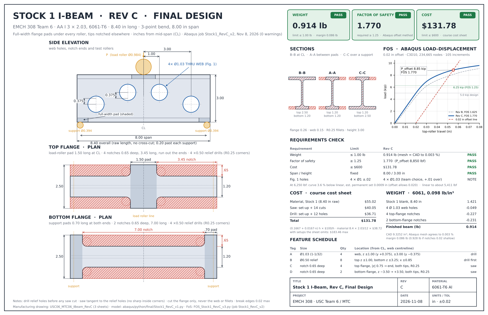

# Final Design: Rev C (Stock 1, roller pads + sawn notches)

> **Status: warning-free Abaqus rerun complete (Nov 8, 2026, job `Stock1_RevC_v2`, 0 warnings, 0 errors): meets weight, FoS and cost.** FoS 1.770, weight 0.914 lb, cost $131.78 (the Nov 3 v1 run gave FoS 1.772). Drawing, design sheet and STEP file done. Optional: mesh-convergence check. The last fully analysed design, Rev B, is in [`Old_Designs/RevB_Stock1_Drilled_v2/`](../Old_Designs/RevB_Stock1_Drilled_v2/).

These are **copies**: each file also stays in its original location (listed below). Change the original, then refresh the copy here.

## Summary

- **Stock:** Stock 1, AA I 3 × 2.03 (6061-T6), full 8.40 in raw length (no cross-cut; 0.20 in overhang past each support, Rev B had 0.10 in)
- **Flanges:** full 2.50 in width wherever a test roller touches:
  - top flange, |z| ≤ 0.75 in from mid-span (load roller)
  - bottom flange, |z| ≥ 3.50 in (both supports)
  - everywhere else the tips are notched 0.65 in deep, leaving the flange 1.20 in wide
- **Corners:** 8 × Ø0.50 relief holes drilled first; the saw cuts end tangent to them, so every inside corner is R0.25 (MTC cannot make sharp corners)
- **Web:** unchanged except the 4 required Fig. 1 holes, opened to Ø1.03 (1-1/32 drill)

| Requirement | Limit | Rev C | |
|---|---|---|---|
| Weight (0.098 lb/in³) | ≤ 1.00 lb | 0.914 lb (Abaqus mesh 0.9139 lb, matches CAD to 0.003 %; 0.928 lb if every notch is 0.02 in shallow) | Pass |
| Factor of safety (FoS), 0.02 in offset method | ≥ 1.25 | **1.770** (P_offset = 8,850 lbf, Abaqus job `Stock1_RevC_v2`, 234,665-node mesh, 0 solver warnings; v1: 1.772) | Pass |
| Cost (course cost sheet) | ≤ $600 | $131.78 | Pass |

| Item | Calculation | Cost |
|---|---|---|
| Material, Stock 1 | 8.4 in × 2.03/12 lb/in × $38.72/lb | $55.02 |
| Saw (14 cuts) | (0.1667 + 0.0167 × 14) h × $100/h | $40.05 |
| Drill (4 web + 8 relief = 12 holes) | (0.1667 + 0.0167 × 12) h × $100/h | $36.71 |
| **Total** | | **$131.78** |

With setups the sheet does not model (second drill size, flipping between flanges, a cross-cut) the total is $183.46. If MTC has to mill the notches instead of sawing them, the cost rises to about $1,860–$3,890 and fails the limit.

## Open items before release to MTC

1. ~~Run the Rev C Abaqus model~~ Done Nov 3, 2026 (`Stock1_RevC_v1`): FoS 1.772, 7 solver warnings from one rejected attempt at increment 2. ~~Warning-free rerun~~ Done Nov 8, 2026 with `Stock1_RevC_Job_v1.py` (`Stock1_RevC_v2`): **0 warnings, 0 errors, FoS 1.770** (−0.08 % vs v1; stiffness +0.8 %), so the v1 result was sound. Optional: mesh-convergence job (`MESH_LEVEL = 'CHECK'` in `Stock1_RevC_v1.py`), then `FOS_Stock1_RevC_v3.py`.
2. Confirm with David Wilson (MTC) that the notches can be sawn out to the relief holes.
3. Fig. 1 allows Ø1.00 ± 0.02 (0.98–1.02); the Ø1.03 holes are a deliberate team choice.
4. ~~Make the Rev C manufacturing drawing~~ Done: `Drawings/USC06_MTC06_IBeam_RevC_Drawing.pdf` (3 sheets). ~~STEP file~~ Done: `CAD/USC06_MTC06_IBeam_RevC.step` (inches), checked in a CAD kernel: one valid solid, 8.40 × 2.50 × 3.00 in, 9.3252 in³ (0.914 lb), 4 × Ø1.03 web holes, 8 × R0.25 notch corners.

## What's here

| Folder | File | What it is | Original location |
|---|---|---|---|
| `Drawings/` | `Design_Sheet_Stock1_RevC_v2.pdf` / `.png` | One-page design sheet: views, dimensions, Abaqus FoS curve (v2 run), cost, weight, feature schedule (`_v1` = Nov 3 numbers, kept for reference) | `cad/drawings/` |
| | `USC06_MTC06_IBeam_RevC_Drawing.pdf` + `_sheet1–3.png` | Manufacturing drawing for MTC (3 sheets, 1:1) | `cad/` |
| | `Proposal_RevC_Stock1_v2.pdf` / `.png` | Concept sheet: flange plans, side view, sections, weight, cost, strength | `cad/concept_drawings/` |
| `Cost/` | `ProjectCostSheet_RevC_Stock1_v2.xlsx` | Course cost sheet, filled in ($131.78) | `cost/` |
| `Scripts/` | `Stock1_RevC_v1.py` | Builds the Rev C beam, finest mesh under the 250,000-node limit, submits the job | `abaqus/python/final/` |
| | `FOS_Stock1_RevC_v1.py` → `_v3.py` | Reads the `.odb`: FoS, weight, cost, solver warnings, accuracy checks, mesh convergence (use v3) | `abaqus/python/final/` |
| | `fix_Stock1_RevC_v1.py` | Warning-free rerun of the v1 model as job `Stock1_RevC_v2` | `abaqus/python/final/` |
| | `Stock1_RevC_Job_v1.py` | **One-step run:** builds + runs `Stock1_RevC_v2` (waits, auto-resubmits once), runs `FOS_Stock1_RevC_v3.py`, refreshes these copies, commits and pushes to GitHub | `abaqus/python/final/` |
| | `Export_STEP_v4.py` | Writes `cad/USC06_MTC06_IBeam_RevC.step` (inches) after geometry checks | `abaqus/python/final/` |
| | `make_RevC_drawing_v1.py` · `make_RevC_design_sheet_v2.py` | Generate the manufacturing drawing and the design sheet | `cad/drawings/source/` |
| | `plot_FOS_RevC_v2.py` | Redraws the FoS plot from the v2 CSV, with the v1 curve overlaid (plain Python) | `abaqus/python/tools/` |
| | `make_RevC_concept_v2.py` | Draws the concept sheet and recomputes weight, cost, stresses | `cad/drawings/source/` |
| `Results/` | `FOS_Stock1_RevC_v2.txt` / `_LoadDisp.csv` | **Reported run:** FoS, weight, cost, solver messages (0 warnings), v1 comparison, accuracy checks; load–displacement data |
| | `FOS_Stock1_RevC_v1.txt` / `_LoadDisp.csv` | Nov 3 run (7 warnings), kept for comparison | `results/final_design/` |
| | `Stock1_RevC_v2_LoadDisp.png` | Load–displacement plot: v2 curve with v1 overlaid, offset line, crossing, 5,000 / 6,250 lbf levels |
| | `Stock1_RevC_v1_LoadDisp.png` | Nov 3 plot | `results/final_design/` |
| | `Design_Comparison.png` | Abaqus curves of the earlier designs | `results/` |
| `Abaqus/` | `Stock1_RevC_v1.cae` / `.jnl` | Rev C Abaqus model | `abaqus/final_design/` |
| `Abaqus/job_v2/` | `Stock1_RevC_v2.cae` / `.inp` / `.jnl` / `_geometry.txt` | **Reported run** (warning-free): model with its job; input file | `abaqus/final_design/job_v2/` |
| `Abaqus/job/` | `Stock1_RevC_v1.cae` / `.inp` / `.jnl` | Nov 3 run: model with its job; input file | `abaqus/final_design/job/` |
| | `Stock1_RevC_v1_geometry.txt` | CAD volumes and mesh settings read by the FoS script | `abaqus/final_design/job/` |
| | `Stock1_RevC_v1.odb` · `Stock1_RevC_v2.odb` | Results, 519 MB each: **local copies only** (too large for the free Git LFS quota); v1 here and in `abaqus/final_design/job/`, v2 only in `abaqus/final_design/job_v2/`; regenerate from the `.inp` | `abaqus/final_design/job/` · `job_v2/` |
| `CAD/` | `USC06_MTC06_IBeam_RevC.step` | 3D model for MTC (inches) | `cad/` |
