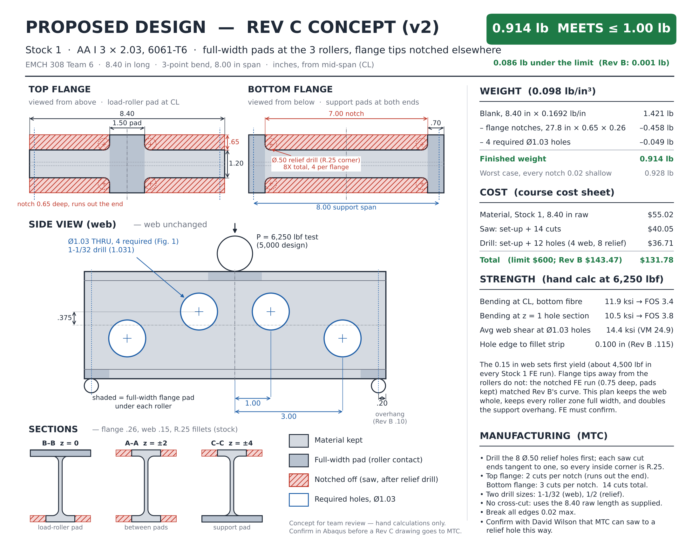

# Final Design: Rev C (Stock 1, roller pads + sawn notches)

> **Status: concept, Abaqus check pending.** Rev C is the team's current final design. Its numbers are hand calculations until the Abaqus model is built and run. The last fully analysed design, Rev B, is in [`Old_Designs/RevB_Stock1_Drilled_v2/`](../Old_Designs/RevB_Stock1_Drilled_v2/).

These are **copies**: each file also stays in its original location (listed below). Change the original, then refresh the copy here.

## Summary

- **Stock:** Stock 1, AA I 3 × 2.03 (6061-T6), full 8.40 in raw length (no cross-cut; 0.20 in overhang past each support, Rev B had 0.10 in)
- **Flanges:** full 2.50 in width wherever a test roller touches:
  - top flange, |z| ≤ 0.75 in from mid-span (load roller)
  - bottom flange, |z| ≥ 3.50 in (both supports)
  - everywhere else the tips are notched 0.65 in deep, leaving the flange 1.20 in wide
- **Corners:** 8 × Ø0.50 relief holes drilled first; the saw cuts end tangent to them, so every inside corner is R0.25 (MTC cannot make sharp corners)
- **Web:** unchanged except the 4 required Fig. 1 holes, opened to Ø1.03 (1-1/32 drill)

| Requirement | Limit | Rev C | |
|---|---|---|---|
| Weight (0.098 lb/in³) | ≤ 1.00 lb | 0.914 lb (0.928 lb if every notch is 0.02 in shallow) | Pass (hand calc) |
| Factor of safety (FoS), 0.02 in offset method | ≥ 1.25 | Abaqus run still to do | Pending |
| Cost (course cost sheet) | ≤ $600 | $131.78 | Pass |

| Item | Calculation | Cost |
|---|---|---|
| Material, Stock 1 | 8.4 in × 2.03/12 lb/in × $38.72/lb | $55.02 |
| Saw (14 cuts) | (0.1667 + 0.0167 × 14) h × $100/h | $40.05 |
| Drill (4 web + 8 relief = 12 holes) | (0.1667 + 0.0167 × 12) h × $100/h | $36.71 |
| **Total** | | **$131.78** |

With setups the sheet does not model (second drill size, flipping between flanges, a cross-cut) the total is $183.46. If MTC has to mill the notches instead of sawing them, the cost rises to about $1,860–$3,890 and fails the limit.

## Open items before release to MTC

1. Run the Rev C Abaqus model (`Stock1_RevC_v1.py`, then `FOS_Stock1_RevC_v1.py`); confirm FoS ≥ 1.25 and where the web first yields. Optional mesh-convergence job: `MESH_LEVEL = 'CHECK'`.
2. Confirm with David Wilson (MTC) that the notches can be sawn out to the relief holes.
3. Fig. 1 allows Ø1.00 ± 0.02 (0.98–1.02); the Ø1.03 holes are a deliberate team choice.
4. Make the Rev C manufacturing drawing and STEP file for MTC.

## What's here

| Folder | File | What it is | Original location |
|---|---|---|---|
| `Drawings/` | `Proposal_RevC_Stock1_v2.pdf` / `.png` | Concept sheet: flange plans, side view, sections, weight, cost, strength | `cad/concept_drawings/` |
| `Cost/` | `ProjectCostSheet_RevC_Stock1_v2.xlsx` | Course cost sheet, filled in ($131.78) | `cost/` |
| `Scripts/` | `Stock1_RevC_v1.py` | Builds the Rev C beam, finest mesh under the 250,000-node limit, submits the job | `abaqus/python/final/` |
| | `FOS_Stock1_RevC_v1.py` | Reads the `.odb`: FoS, weight, cost, accuracy checks, mesh convergence | `abaqus/python/final/` |
| | `make_RevC_concept_v2.py` | Draws the concept sheet and recomputes weight, cost, stresses | `cad/drawings/source/` |
| `Results/` | `Design_Comparison.png` | Abaqus curves of the earlier designs (Rev C to be added) | `results/` |
| `Abaqus/` | *(after the run)* | Rev C model, job and `.odb` | `abaqus/final_design/` |
| `Results/` | *(after the run)* | `FOS_Stock1_RevC_v1.txt` / `_LoadDisp.csv` / `.png` | `results/final_design/` |
| `CAD/` | *(to come)* | Rev C STEP file and MTC manufacturing drawing | `cad/` |
